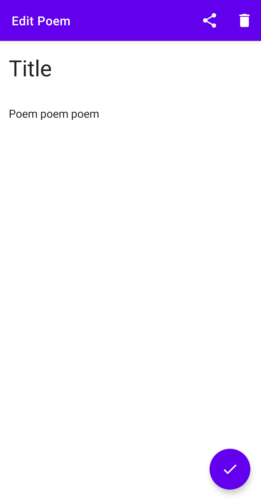

# Heartry
### ***Poems are written from heart.***  

This app is built to facilitate poets to save their poems and synchronize them so that their beautiful creations live longer and stay at their finger tips.

## Features 
 - Online sync 
 - Share modifier (it will automatically add *title\* and append your name at the end)
 
## Example Pictures

## Contributions
Contributions are always welcome kindly check [CONTRIBUTING.md](https://github.com/SirusCodes/Heartry/blob/master/CONTRIBUTING.md)

## Download

## Developer
Darshan Rander - [LinkedIn](https://www.linkedin.com/in/darshan-rander-b28a3b193/)
